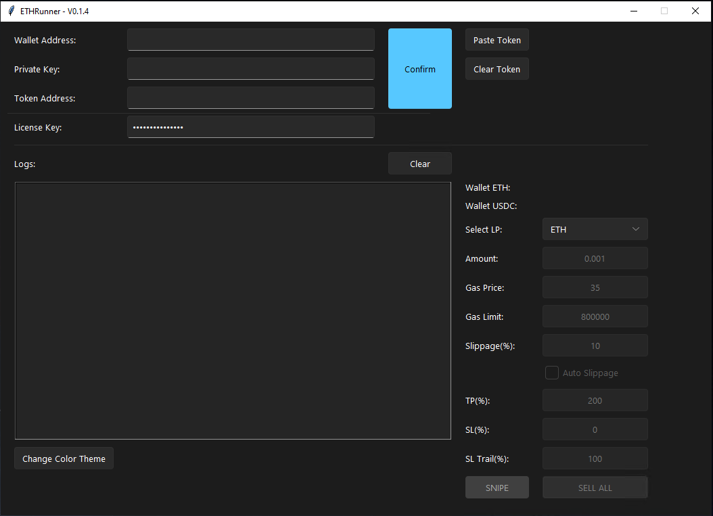

  
 
  <h2>Ethereum Sniping bot</h2>
  
Snipe New Tokens on BASE and all ETH Dexes within 1 millisecond

  
  
  
  

  

<a align="center" href="https://ethrunner.app/">DOWNLOAD NOW</a>  

## 🚀 Features

- 💌 Auto approve
- ⏰ Buy early token gems with custom gas fee, slippage, amount. Bot waits for liquidity (DYOR)
- 🌏 Sell tokens with your custom increase in price, like 50%, 100%, 200%.
- 💸 Contains Stop loss (Set SL% to 0 for no Stop loss, and TP% to 100% for no Trailing stop loss), Trailing Stop loss (for maximum profits) and more. Set TP% (Take profit %) to 120% for 20% gain, 100% is the base so 0x, 200% is 1x on your investment
- 💸 Open source, with free node services (Literally don't have to pay anything to run this bot)
- Enjoy and leave a star, if you like it!

## 📦 Install

Go on https://ethrunner.app and download it!
  

## 💎 Details :)

## 🤝 Sponsors

PancakeX is an MIT-licensed open source project with its ongoing development made possible entirely by the support of these awesome backers

## 📘 Credits

Thanks to all the people who already contributed to making this PancakeX better!

## 📝 Changelog

Detailed changes for each release:

#### • Version v1 [release] - 4 months ago
#### • Version v2 [fixed minor bugs, added more custom settings] - 3 months ago
#### • Version v2.1 [commented code, new functions & more] - 3 months ago
#### • Version v2.2 [added 9 new functions, custom settings page] - 1 month ago
#### • Version v2.3 [fixed minor bugs] - 4 weeks ago
#### • Version v2.4 [minor changes] - 3 weeks ago
#### • Version v3 [global changes, added new functions, log inside the terminal, CROSSCHAIN support] - 1 week ago

## 🔑 License

[MIT]
